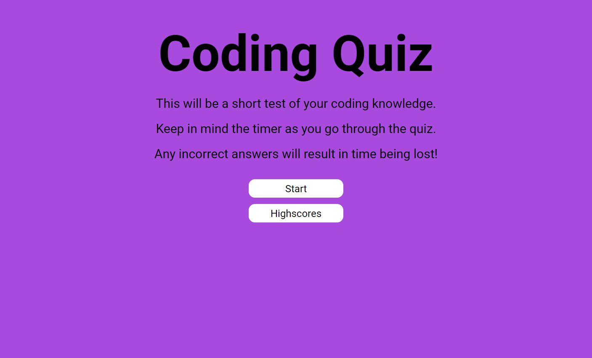

# Module 4 - Coding Quiz
## Description
Create a custom quiz of a certain topic utilising HTML, CSS and JS practices.

## Table of Contents
1. [Visuals](#visuals) 
2. [Usage](#usage)
3. [Link to site](#link-to-site)

## Visuals

## Usage
This coding quiz is a test of my JS knowledge, ensuring that all buttons are operational, the quiz functions as intended and highscores are appended from highest to lowest.
Please keep in mind some of the questions are implamented for comedic purposes.

## Link to site
https://flipper5001.github.io/coding-quiz/

